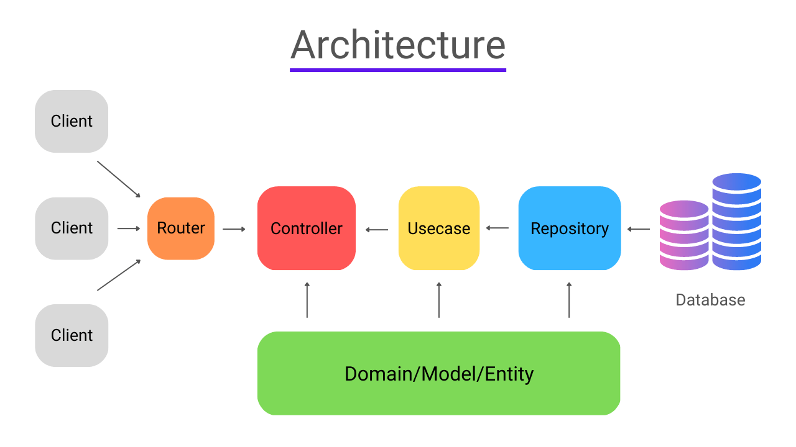

# what is GitHub?

## What is Git?

Git is a distributed version control system used to track changes in source code during software development.

- Records snapshots of files over time.
- Lets you create branches to work on features separately.
- Allows you to commit changes, view history, and revert if needed.

Example Git commands:

```bash
# initialize a repository
git init

# check status
git status

# add files to staging area
git add .

# commit changes
git commit -m "Initial commit"

# create a branch
git branch feature-branch

# switch to branch
git checkout feature-branch
```

## What is GitHub?

GitHub is a web-based platform for hosting Git repositories and collaborating with others.

- Stores repositories in the cloud.
- Provides tools for pull requests, issues, code review, and project management.
- Makes it easy to share code and collaborate across teams.

Example GitHub workflow:

```bash
# clone a GitHub repository
git clone https://github.com/username/repo.git

# make changes locally
git add changed-file.js
git commit -m "Update feature"

# push changes to GitHub
git push origin main
```

## How Git and GitHub work together

- Use Git locally to manage your code and history.
- Use GitHub to host the repository and share it with others.
- Git pushes and pulls data to and from GitHub.

Example:

1. Create a repo on GitHub.
2. Clone it locally with `git clone`.
3. Work locally with `git add` and `git commit`.
4. Push changes with `git push`.
5. Collaborators can pull changes with `git pull`.


## github architectures




