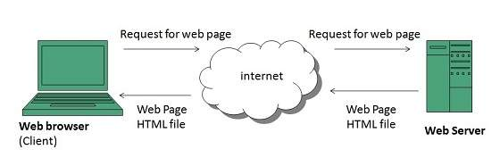

# what is www ?
  1. www stands for world wide web
  2. www is used to access any URL world wide for any web apps there we used www.

  **examples**

  ```
  https://www.tops-int.com/

  ```

 **architectures of www**

  
     